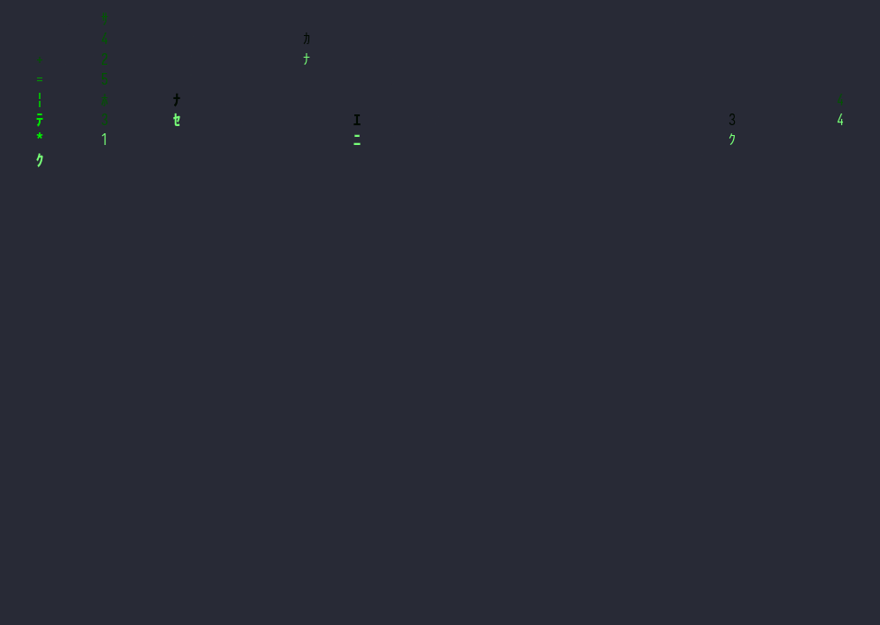

# termzzz

[](https://crates.io/crates/termzzz)
[](https://docs.rs/termzzz)
[](https://github.com/JavohirMX/termzzz/blob/main/LICENSE)
[](https://github.com/JavohirMX/termzzz/actions/workflows/test.yml)



**23 terminal screensavers and generative visual effects, written in Rust.**

Run one effect, play a playlist, or walk the whole catalogue behind a wipe. No
assets, no configuration, no runtime dependencies on the terminal beyond ANSI.

## Install

With Homebrew:

```bash
brew tap JavohirMX/termzzz
brew install JavohirMX/termzzz/termzzz
```

Or with cargo:

```bash
cargo install termzzz
```

Or from a checkout:

```bash
cargo install --path .
```

Every route installs the same `termzzz` binary.

## What it does

- **23 effects.** The classics, plus a fractal flyover, slime-mould agents
  building a transport network, a fish tank in two rendering media, and a clock
  with a rule showing the seconds.
- **A playlist.** `--playlist` plays effects back to back with a diagonal wipe
  between them. `--shuffle` runs the whole catalogue in a random order.
- **Walk the catalogue live.** `n` and `p` change effect without restarting,
  behind the same wipe.
- **Global speed control.** `+` and `-` scale every effect at once.
- **Reproducible runs.** Every effect that uses randomness is seeded. Pin one with
  `--seed 1234` and share the exact run.
- **A new picture every launch.** With no seed, each effect draws its own, so no
  two runs look alike.
- **Draws beyond the character grid.** Braille cells (8 dots each) and half
  blocks (two colours per cell) give several effects far more detail than a
  character terminal can.
- **Two interactive effects.** Scatter a flock with the mouse, or pour ink into a
  generative field.

## Effects

| Effect | What you see | Draws with |
|---|---|---|
| `matrix` | Digit rain, each drop fading through its own tail | characters |
| `life` | Conway's Game of Life. Colour is the cell's age, so generations are visible | characters |
| `mandelbrot` | The escape-time Mandelbrot set, zooming and panning | half blocks |
| `maze` | Maze generation, held when it finishes | characters |
| `boids` | A flock. Click to scatter it; drag to leave a trail | characters |
| `cube` | A rotating 3D cube, filled and shaded by depth | braille + ramp |
| `crab` | Crabs scuttling along a sloping seabed | characters |
| `donut` | A rotating 3D donut | ramp |
| `dvd` | The DVD wordmark, bouncing | braille |
| `pipes` | Pipe maze growth | characters |
| `plasma` | Interfering waves. The glyph is the value | ramp |
| `fire` | Fire, rising and cooling | ramp |
| `solarsystem` | An orrery with tilted orbits and real orbital periods | braille |
| `ink` | A generative field you pour ink into. **Interactive** | characters |
| `terrain` | A side-view landscape: two ridges, parallax, sky | ramp |
| `ants` | Several Langton's ants sharing one board | ramp |
| `flyover` | First-person flight over a fractal height field | braille |
| `physarum` | Slime-mould agents building a transport network | half blocks |
| `ripple` | Waves from a few point sources, interfering | half blocks |
| `newton` | Newton's method on the complex plane, coloured by which root each cell reaches | ramp |
| `aquarium` | A fish tank. Seven species, two rendering media, shaded by depth | braille |
| `clock` | A large clock, with a rule showing the seconds | braille |
| `blank` | A blank screen. What a playlist rests on | — |

*ramp* means the character is chosen from an ordered glyph ramp so that its ink
matches the value being drawn.

## Running one

```bash
termzzz aquarium
termzzz flyover --speed 0.5
```

`--speed` scales every effect, on top of calmer per-effect defaults.

### Keys

| Key | Action |
|---|---|
| `q`, `Esc`, `Ctrl+C` | Quit |
| `+` / `-` | Speed up / slow down every effect |
| `n` / `p` | Next / previous effect |
| `r` | Reseed the field (`ink`) |
| `Space` | Pause and resume (`ink`) |
| `[` / `]` | Cycle glyph palettes (`ink`) |

### Mouse

Click in `boids` to scatter the flock. A click drops a shockwave that travels
outward and pushes the boids it passes away from where you clicked, and the ring
is drawn so you can see how far it reaches. Drag to leave a trail. Just moving the
mouse does nothing; the flock reacts to a button press and then closes up again,
because the rules holding it together keep running.

In `ink`: the wheel resizes the brush, and pointer movement brightens the field
before the brightness fades.

Mouse capture is enabled whenever the running effect, or any effect in the
playlist, reads it, so `n` can reach an interactive effect at any moment without
the terminal being reconfigured mid-run.

## Playlist

```bash
termzzz --playlist matrix,dvd,plasma      # in order
termzzz --playlist matrix,dvd --transition 1.5
termzzz --shuffle                         # the whole catalogue, random order
```

Per-effect durations live in the config file:

```toml
[playlist]
shuffle = true
transition = 0.6

[[playlist.effects]]
effect = "matrix"
duration = 12.0

[[playlist.effects]]
effect = "dvd"
```

`duration` is optional and defaults per effect. Leaving `effects` empty plays
every effect.

## Reproducible runs

Leave `--seed` off and every effect draws a fresh seed at startup. Pin one to
reproduce a particular run:

```bash
termzzz matrix --seed 1234
termzzz --playlist matrix,dvd --seed 1234
```

Seeds can also be set per effect in the config file, for example
`[matrix] seed = 7`.

## Configuration

Configuration is optional. Generate a default file with:

```bash
termzzz --print-config > ~/.config/termzzz.toml
```

It lives at `~/.config/termzzz.toml`, or `%APPDATA%\termzzz.toml` on Windows.
Global speed is `[global] speed`. The DVD logo is configurable, and `\n` inside
`logo` gives you multiple lines:

```toml
[global]
speed = 1.0

[dvd]
logo = "termzzz"
speed = 9.0
corner_color_change = true
```

While the terminal is not focused, effects throttle to `[global] idle_fps` and
freeze rather than slow down, so nothing jumps when you come back.

## Requirements

Rust 1.89 or newer. macOS and Linux are the supported targets; the test suite
also runs on Windows in CI, but Windows is not a supported platform yet.

**Your terminal font needs braille and block characters.** `dvd`, `solarsystem`,
`flyover`, `clock`, `aquarium` and `cube` draw braille patterns, and `fire`,
`terrain`, `plasma` and `cube` draw the block elements `▁▂▃▄▅▆▇█` and the
shades `░▒▓`. A font without them renders those effects as boxes or gaps.

This catches people out more often than you would expect. Checked across every
font installed on one machine, Menlo, Andale Mono, DejaVu Sans Mono, Fira Code
and JetBrains Mono all ship the block elements and **none** of them ship a single
braille glyph. Most of the usual suspects are the problem rather than the
solution.

[Iosevka](https://typeof.net/Iosevka/) has both and is monospace. To check any
font yourself, with `pip install fonttools`:

```bash
python3 -c "
from fontTools.ttLib import TTCollection, TTFont
cmap = set(TTFont('/path/to/font.ttf').getBestCmap())
print('braille:', sum(c in cmap for c in range(0x2800, 0x2900)), '/256')
print('blocks :', sum(c in cmap for c in range(0x2581, 0x2589)), '/8')
"
```

## Development

```bash
cargo build --release
cargo test
cargo fmt --all -- --check
cargo clippy --all-features --workspace --all-targets -- -D warnings
cargo run --release --example frame_times   # frame cost and ANSI volume per effect
```

Architecture notes are in [`specs/overview.md`](specs/overview.md); the release
routine is in [`specs/release.md`](specs/release.md).

## Attribution

Built on MIT-licensed code from [oiwn/tarts](https://github.com/oiwn/tarts), an
earlier terminal screensaver project. The original copyright notice remains in
`LICENSE`.

## License

MIT. See `LICENSE`.